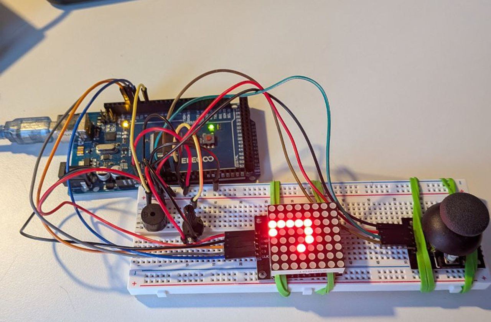

# Arduino Snake Game

## Overview

This project is an Arduino-based implementation of the classic Snake game on an 8x8 LED matrix. The snake is controlled using a joystick, and the game speed can be dynamically adjusted with a potentiometer. A buzzer provides sound feedback when the snake eats food or the game ends.

## Features

- Real-time snake movement on an 8x8 LED matrix
- Joystick input for directional control
- Potentiometer-controlled game speed
- Buzzer sound effects for food and game over

## What I Learned

- Interfacing a joystick and potentiometer with Arduino
- Driving an 8x8 LED matrix using the LedControl library
- Using arrays to represent the snake’s body and movement
- Mapping analog inputs to control game parameters

## Images

### Game in Action

## Possible Future Improvements

- Add levels or increasing difficulty
- Implement a high-score system
- Use different sound tones for different events
- Add more complex LED animations
